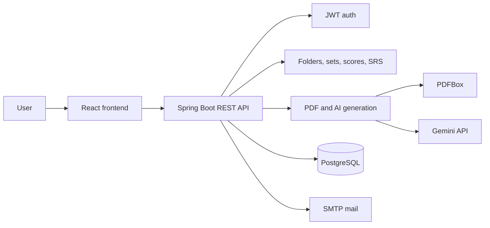
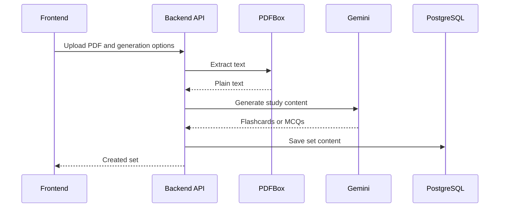

# Recallify

Recallify is a study app for creating folders, generating study sets from PDFs, and reviewing MCQs or flashcards. The monorepo contains a Spring Boot REST API and a Vite React frontend.

## Repo Layout

```text
Recallify/
  backend/   Spring Boot API
  frontend/  React + Vite client
```

## Stack

- Backend: Java 17, Spring Boot 3.5, Spring Security, Spring Data JPA, PostgreSQL, Apache PDFBox, Apache Lucene
- Frontend: React 19, TypeScript, Vite, TanStack Query, React Router, Tailwind CSS
- AI generation: Google Gemini API

## Architecture



## Local Development

Run the backend:

```bash
cd backend
./run-backend.sh
```

Run the frontend:

```bash
cd frontend
npm install
npm run dev
```

The frontend dev server runs on `http://localhost:5173` and proxies `/api` to `http://localhost:8080`.

## Environment

Backend configuration can be provided through environment variables or `backend/.env`:

```properties
DB_HOST=localhost
DB_PORT=5432
DB_NAME=recallify
DB_USERNAME=postgres
DB_PASSWORD=postgres
GEMINI_API_KEY=...
JWT_SECRET_KEY=replace-with-at-least-32-bytes
SPRING_MAIL_HOST=smtp.example.com
SPRING_MAIL_PORT=587
SPRING_MAIL_USERNAME=...
SPRING_MAIL_PASSWORD=...
PORT=8080
```

For a deployed frontend, set `VITE_API_URL` to the backend origin, without `/api`:

```properties
VITE_API_URL=https://example.com
```

## Build And Test

Backend:

```bash
cd backend
./mvnw test
./mvnw clean package
```

Frontend:

```bash
cd frontend
npm run lint
npm run build
```

## Main Flows



## Docker

Build and run the backend container:

```bash
cd backend
docker build -t recallify-api .
docker run --env-file .env -p 8080:8080 recallify-api
```

## Current Notes

- Sets are created inside an owned folder; `folderId` is required by the backend.
- The frontend public library currently calls `/api/folder/public`, but the backend exposes public sets at `/api/set/public` and has no public folder endpoint yet.
