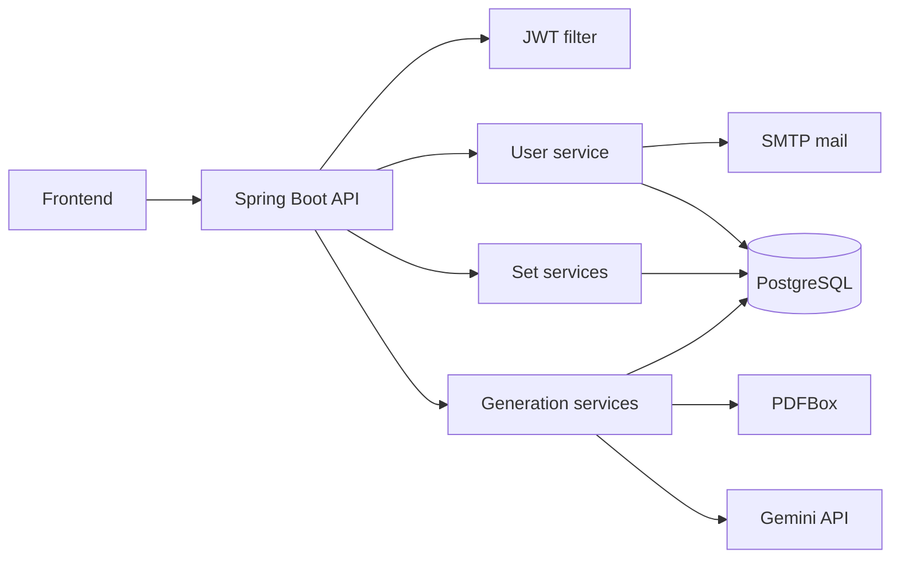
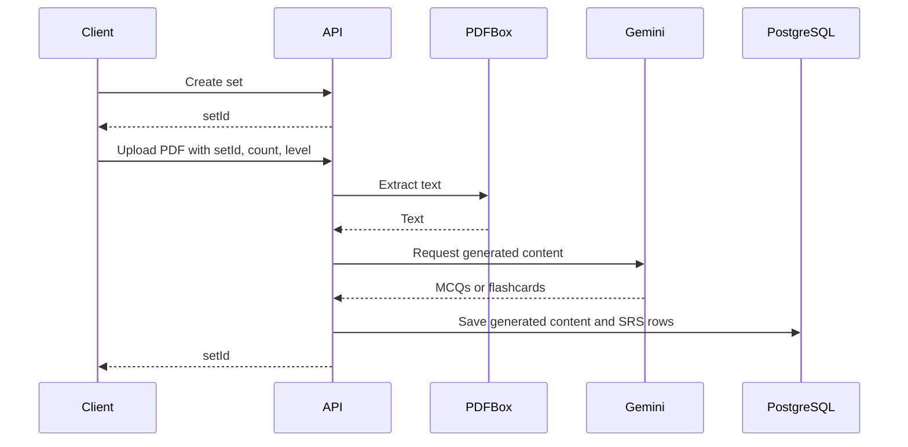

# Recallify Backend

Spring Boot REST API for Recallify. It handles authentication, folders, folder-owned study sets, MCQs, flashcards, PDF extraction, Gemini generation, SRS metadata, scores, and password reset email.

## Stack

- Java 17
- Spring Boot 3.5
- Spring Web
- Spring Security with JWT
- Spring Data JPA
- PostgreSQL
- Apache PDFBox
- Apache Lucene
- Google Gemini API
- Spring Mail
- Maven Wrapper

## Project Layout

```text
backend/
  src/main/java/com/andy/recallify/
    RecallifyApplication.java
    features/
      generation/  PDF upload and Gemini generation
      set/         folders, sets, MCQs, flashcards, scores, SRS
      user/        auth, profile, refresh tokens, password reset
    shared/
      config/      mail configuration
      security/    JWT utilities, auth filter, security config
  src/main/resources/
    application.yml
  run-backend.sh  wrapper for ./mvnw spring-boot:run
```

## Architecture



## Requirements

- Java 17
- PostgreSQL database
- Gemini API key
- SMTP account for password reset email

## Environment

The app imports `optional:file:.env[.properties]` from the backend working directory. You can provide values through process environment variables or `backend/.env`.

```properties
DB_HOST=localhost
DB_PORT=5432
DB_NAME=recallify
DB_USERNAME=postgres
DB_PASSWORD=postgres
GEMINI_API_KEY=...
JWT_SECRET_KEY=replace-with-at-least-32-bytes
SPRING_MAIL_HOST=smtp.example.com
SPRING_MAIL_PORT=587
SPRING_MAIL_USERNAME=...
SPRING_MAIL_PASSWORD=...
PORT=8080
```

Notes:

- `server.port` defaults to `8080`.
- PostgreSQL is configured with `sslmode=require`.
- `spring.jpa.hibernate.ddl-auto` is `none`, so the database must already be prepared.
- Multipart uploads are limited to `80MB`.
- Health/info actuator endpoints are exposed.

## Run Locally

```bash
./run-backend.sh
```

or:

```bash
./mvnw spring-boot:run
```

The API listens on:

```text
http://localhost:8080
```

## Test And Build

```bash
./mvnw test
./mvnw clean package
```

## Docker

```bash
docker build -t recallify-api .
docker run --env-file .env -p 8080:8080 recallify-api
```

## Authentication

Most routes require:

```http
Authorization: Bearer <accessToken>
```

Public routes:

- `POST /api/user/register`
- `POST /api/user/login`
- `POST /api/user/sendResetCode`
- `POST /api/user/verifyResetCode`
- `PUT /api/user/resetPassword`
- `POST /api/user/refresh`

The backend is stateless. Login and registration return an access token and refresh token. Logout invalidates the stored refresh token.

Allowed CORS origins:

- `http://localhost:5173`
- `https://recallify-fe.vercel.app`

## API Reference

### User

| Method | Route | Description |
| --- | --- | --- |
| `POST` | `/api/user/register` | Create user and return tokens |
| `POST` | `/api/user/login` | Authenticate and return tokens |
| `PUT` | `/api/user/edit` | Update profile and return new tokens |
| `POST` | `/api/user/sendResetCode` | Email password reset code |
| `POST` | `/api/user/verifyResetCode` | Validate reset code |
| `PUT` | `/api/user/resetPassword` | Set a new password |
| `POST` | `/api/user/refresh` | Exchange refresh token for access token |
| `POST` | `/api/user/logout` | Invalidate refresh token |

### Folders

| Method | Route | Description |
| --- | --- | --- |
| `POST` | `/api/folder/create` | Create a folder |
| `GET` | `/api/folder/my` | List the current user's folders |
| `POST` | `/api/folder/edit` | Rename or change visibility |
| `DELETE` | `/api/folder/delete/{folderId}` | Delete a folder |
| `POST` | `/api/folder/moveSet` | Move a set into a folder |
| `GET` | `/api/folder/{folderId}/sets` | List sets in a folder |

### Sets

| Method | Route | Description |
| --- | --- | --- |
| `POST` | `/api/set/create` | Create a set in an owned folder |
| `GET` | `/api/set/my` | List the current user's sets |
| `GET` | `/api/set/public` | List public sets |
| `GET` | `/api/set/meta/{setId}` | Get set metadata |
| `POST` | `/api/set/edit` | Update title, visibility, and content |
| `POST` | `/api/set/copy/{sourceSetId}` | Copy a set into an owned folder |
| `DELETE` | `/api/set/delete/{setId}` | Delete a set |

`create` and `copy` require `folderId` in the request body.

### MCQs

| Method | Route | Description |
| --- | --- | --- |
| `POST` | `/api/mcq/generate-from-pdf` | Generate MCQs from an uploaded PDF |
| `GET` | `/api/mcq/get/{setId}` | Get MCQs for a set |
| `POST` | `/api/mcq/SRS/update/{mcqId}` | Update MCQ SRS data |

`generate-from-pdf` expects multipart form data:

- `setId`
- `count`
- `level`
- `file`

### Flashcards

| Method | Route | Description |
| --- | --- | --- |
| `POST` | `/api/flashcard/generate-from-pdf` | Generate flashcards from an uploaded PDF |
| `GET` | `/api/flashcard/get/{setId}` | Get flashcards for a set |
| `POST` | `/api/flashcard/SRS/update/{flashcardId}` | Update flashcard SRS data |

`generate-from-pdf` expects multipart form data:

- `setId`
- `count`
- `level`
- `file`

### Scores

| Method | Route | Description |
| --- | --- | --- |
| `POST` | `/api/score/store` | Store an MCQ score |
| `GET` | `/api/score/get/{setId}` | Get score history for a set |

### Generation Utilities

| Method | Route | Description |
| --- | --- | --- |
| `POST` | `/api/upload/pdf` | Extract text from a PDF |
| `POST` | `/ai/generateMcqs` | Generate MCQs from text |
| `POST` | `/ai/generateFlashcards` | Generate flashcards from text |

These routes are authenticated. The frontend uses the PDF generation routes under `/api/mcq` and `/api/flashcard`.

## Current Frontend Contract

- Dashboard uses `/api/folder/my` and `/api/folder/create`.
- Folder detail uses `/api/folder/{folderId}/sets`.
- Public library currently calls `/api/folder/public`; that endpoint is not implemented in this backend.

## Generation Flow



## Troubleshooting

- `401 Unauthorized`: log in again or refresh the access token with `/api/user/refresh`.
- CORS failure: confirm the frontend origin is listed in `SecurityConfig`.
- Database connection failure: confirm `DB_*` values and that the database accepts SSL connections.
- Empty generation result: confirm `GEMINI_API_KEY`, PDF text extraction, and generation limits in `application.yml`.
