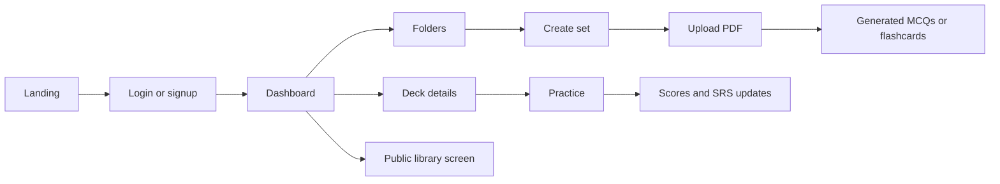
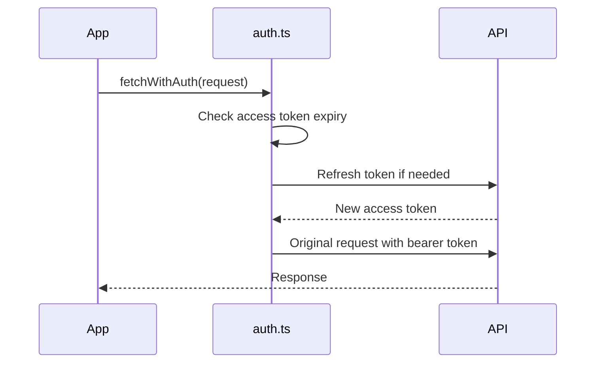

# Recallify Frontend

React + Vite client for Recallify. It provides the landing page, auth modal, folder dashboard, public library screen, folder-scoped set creation, PDF-based generation, MCQ practice, flashcard practice, editing, profile management, and score history.

## Stack

- React 19
- TypeScript
- Vite
- React Router
- TanStack Query
- i18next
- Recharts
- Lucide React
- Tailwind CSS/PostCSS
- ESLint

## Project Layout

```text
frontend/
  public/             static assets
  src/
    App.tsx           route tree and auth shell
    main.tsx          React entrypoint
    auth.ts           token refresh and authenticated fetch helper
    jwt.ts            JWT parsing and expiry checks
    config.ts         API base URL
    i18n.ts           translations setup
    components/       shared UI components
    pages/            route-level screens
```

## App Flow



## Routes

| Route | Page | Auth |
| --- | --- | --- |
| `/` | Landing page | Public |
| `/dashboard` | User folder dashboard | Required |
| `/library` | Public folder library screen | Required |
| `/folders/:folderPublicId` | Folder detail | Required |
| `/sets/:setId` | Set detail and score history | Required |
| `/sets/:setId/MCQ/edit` | Edit MCQs | Required |
| `/sets/:setId/Flashcard/edit` | Edit flashcards | Required |
| `/learn/MCQ/:setId` | MCQ practice | Required |
| `/learn/Flashcard/:setId` | Flashcard practice | Required |
| `/create` | Create a folder-scoped set and generate PDF content | Required |

Unknown routes redirect to `/`.

## API Configuration

The API base URL is defined in `src/config.ts`:

```ts
export const API_BASE_URL =
  import.meta.env.VITE_API_URL
    ? import.meta.env.VITE_API_URL + "/api"
    : "/api";
```

Local development uses Vite's proxy:

```ts
server: {
  port: 5173,
  proxy: {
    "/api": {
      target: "http://localhost:8080",
      changeOrigin: true,
    },
  },
}
```

For deployment, set `VITE_API_URL` to the backend origin without `/api`:

```properties
VITE_API_URL=https://example.com
```

## Authentication

The frontend stores auth state in `localStorage`:

- `token`: access token
- `refreshToken`: refresh token
- `email`: current user email
- `name`: current user name

`src/auth.ts` provides:

- `refreshIfNeeded()`: refreshes the access token when it is missing or expired.
- `fetchWithAuth()`: sends the bearer token, retries once after a `401`, and preserves `FormData` requests for PDF uploads.



## Backend Calls

- Folders: `/api/folder/my`, `/api/folder/create`, `/api/folder/{folderId}/sets`, `/api/folder/delete/{folderId}`.
- Sets: `/api/set/create`, `/api/set/meta/{setId}`, `/api/set/edit`, `/api/set/copy/{setId}`, `/api/set/delete/{setId}`.
- Generation: `/api/mcq/generate-from-pdf` and `/api/flashcard/generate-from-pdf` with `setId`, `count`, `level`, and `file`.
- Study: `/api/mcq/get/{setId}`, `/api/flashcard/get/{setId}`, `/api/mcq/SRS/update/{id}`, `/api/flashcard/SRS/update/{id}`, `/api/score/store`, `/api/score/get/{setId}`.
- Current mismatch: `PublicLibrary.tsx` and the folder fallback call `/api/folder/public`, but the backend does not implement that route yet.

## Run Locally

Install dependencies:

```bash
npm install
```

Start the dev server:

```bash
npm run dev
```

Open:

```text
http://localhost:5173
```

The backend should be running on:

```text
http://localhost:8080
```

## Scripts

| Command | Description |
| --- | --- |
| `npm run dev` | Start Vite dev server |
| `npm run build` | Type-check and build production assets |
| `npm run lint` | Run ESLint |
| `npm run preview` | Preview the production build locally |

## Build

```bash
npm run build
```

Build output is written to:

```text
dist/
```

## Deployment

`vercel.json` rewrites all routes to `/`, so React Router can handle deep links in production.

The deployed frontend must be served from an origin allowed by the backend CORS config. Current backend allowlist:

- `http://localhost:5173`
- `https://recallify-fe.vercel.app`

If the deployed URL changes, update backend CORS before deploying.

## Main Screens

- `Landing.tsx`: public entry screen and signup prompt
- `Dashboard.tsx`: current user's folders and study sets
- `PublicLibrary.tsx`: public folders screen; currently depends on `/api/folder/public`
- `Folder.tsx`: sets inside a folder
- `Create.tsx`: folder-scoped set creation and PDF generation flow
- `DeckDetails.tsx`: set metadata, actions, and scores
- `LearnMCQ.tsx`: MCQ practice and score submission
- `LearnFlashcard.tsx`: flashcard practice and SRS updates
- `EditMCQs.tsx`: edit MCQ content
- `EditFlashcards.tsx`: edit flashcard content

## Troubleshooting

- API calls return `404` locally: confirm the backend is running on port `8080`, Vite is running on port `5173`, and the frontend route has a matching backend route.
- API calls return `401`: clear local storage and log in again.
- CORS failure in production: add the deployed frontend origin to backend `SecurityConfig`.
- PDF generation fails: confirm the request is sent as `FormData` and the backend has `GEMINI_API_KEY`.
